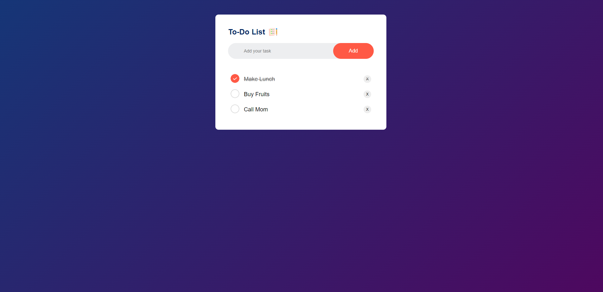

# Todo-List-App

<h2>About the project</h2>

  
It is a javascript game created to play a guessing game

👉 Live Demo: <a href='#'>Live Demo</a>

<h3>Build with:</h3>

» HTML  
» Javascript  
» CSS

<h2>Screenshots of the Project 📸</h2>
 

